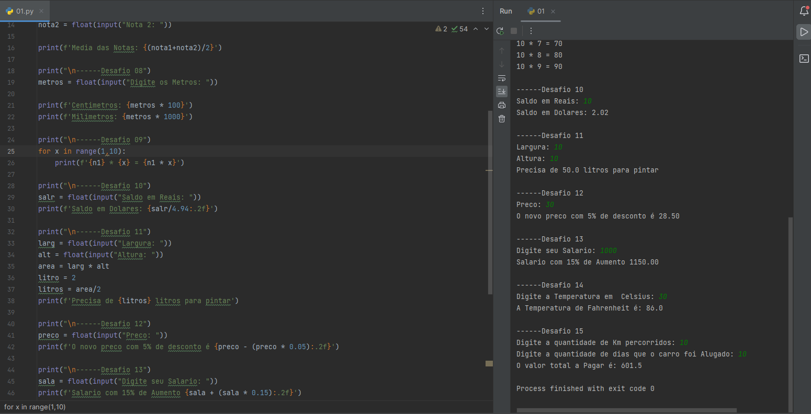

<h1 align="center">Desafios Python</h1>

 

 

# Tecnologias
Este projeto foi desenvolvido utilizando:
    
          
 
 

# Status do projeto
Concluido.

 

# Inspiração
Desafios propostos no curso de Python do Curso em Video.

 

